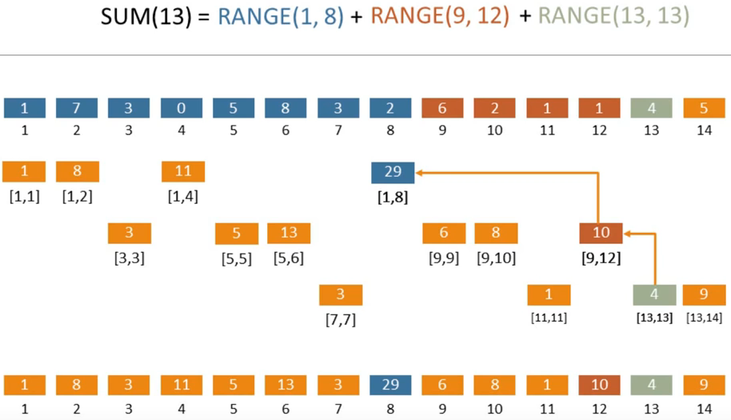
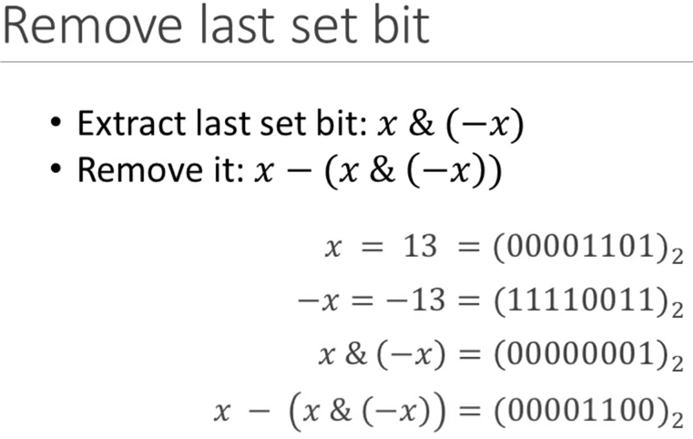
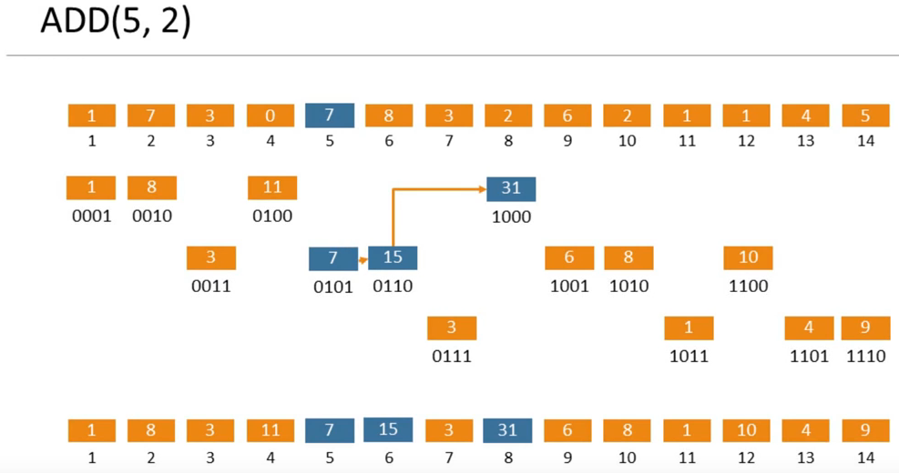

# Implement a Binary Indexed Tree (Fenwick Tree)

Tutorial and Source Video: https://www.youtube.com/watch?v=v_wj_mOAlig&t=1s

## Problem Decription:

Given an array of numbers the program must be able to query a sum of a range of numbers, update the values of indices using a Binary Indexed Tree.

## Functions to implement:

**Update:**
	
	Update the value of an idex of the array by adding a value

**Sum:**
	
	Find the sum of the values up to and including the given index

**Sum-Range:**
	
	Find the sum between the range of indices, both inclusive

## How it works:

A Binary Indexed Tree stores the sum of **ranges** of values in the given array. See the screenshot below:



Likewise, when finding the addition up to an index, the relevant ranges are added together, as seen in the above screenshot.

Traversal between the correct squares is done by modifying the last "set bit" in the index. See the screenshot below.




Going backwards to sum the ranges is done by taking away by the value of the last set bit, and going forwards to update new values of the table is done by adding the last set bit.

Going backwards (To the beginning of the array)
```
	index -= (index & -index)
```

Going forwards (down the array)
```
	index += (index & -index)
```

Going forwards is done when updating ranges when the value of a given index in the array has changed.

